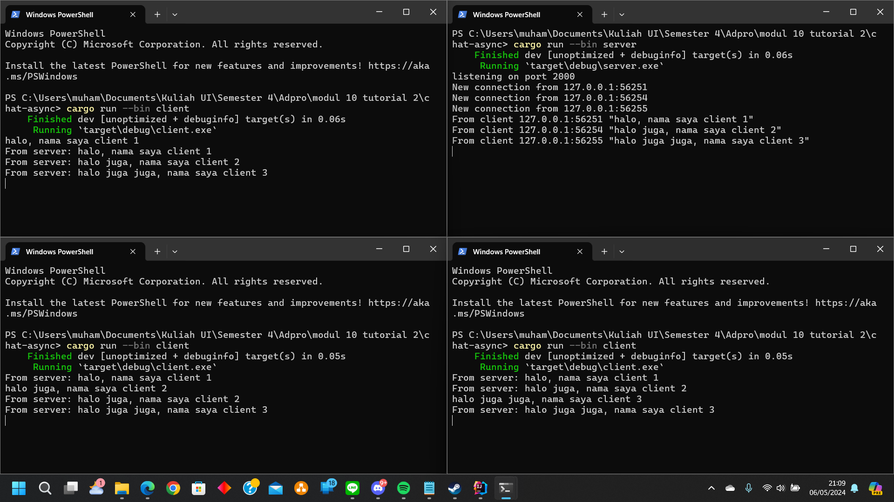

# Original code of broadcast chat

_Client_ dan _Server_ saling terhubung melalui WebSocket. _Server_ akan mendengerkan pesan dari _Client_ melalui WebSocket, lalu akan meneruskan pesan tersebut ke semua _Client_ yang terhubung. Sehingga, ketika saya ketik sebuah pesan dari salah satu _Client_, akan terlihat di 2 _Client_ lainnya.