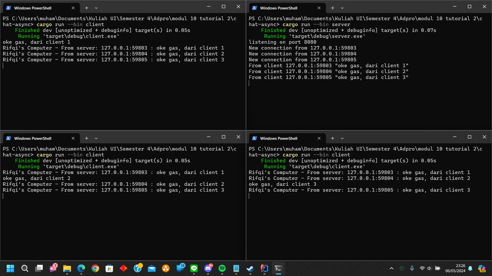

# Original code of broadcast chat

_Client_ dan _Server_ saling terhubung melalui WebSocket. _Server_ akan mendengerkan pesan dari _Client_ melalui WebSocket, lalu akan meneruskan pesan tersebut ke semua _Client_ yang terhubung. Sehingga, ketika saya ketik sebuah pesan dari salah satu _Client_, akan terlihat di 2 _Client_ lainnya.

# _Modifying the websocket port_
Ketika kita mengubah _port_ di salah satu _Client_ atau _Server_, maka keduanya juga harus diubah. Apabila tidak, maka _Client_ dan _Server_ tidak akan terhubung dan tidak bisa mengirim pesan.

# _Small changes_

Saya melakukan pengubahan agar  IP _Client_ dapat dilihat. Saya melakukan pengubahan dengan penambahan format pada bcast_tx.send().